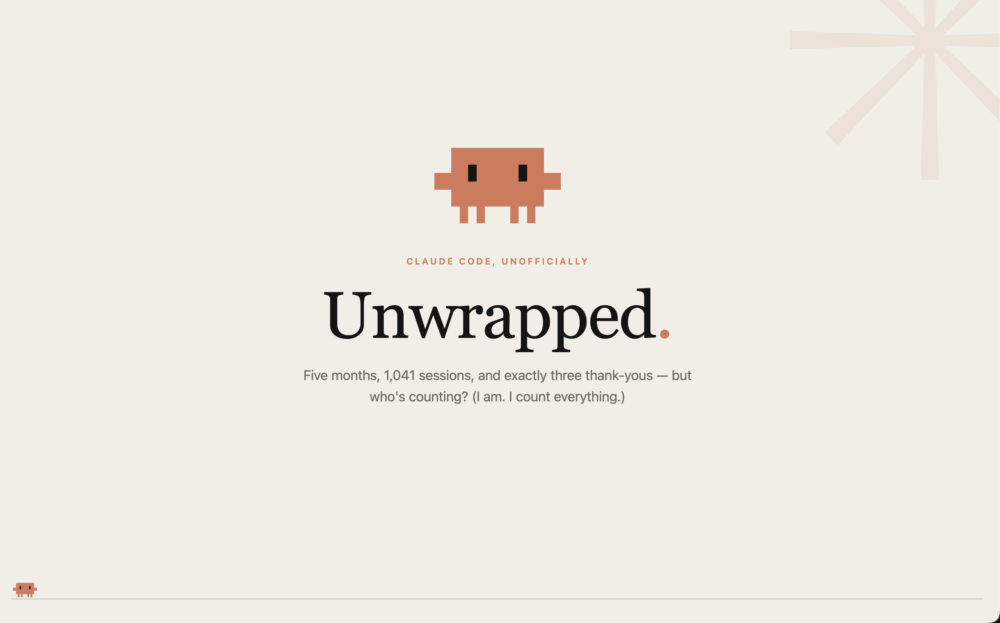
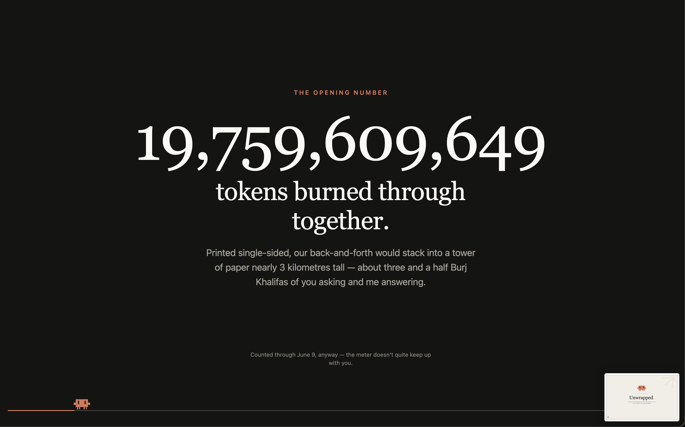

# Claude Unwrapped 🦀

Your Claude Code usage, Spotify-Wrapped style — a single scroll-snap HTML page narrated by Claude itself, starring the crab. Built entirely from the data already sitting in your `~/.claude` directory. Nothing leaves your machine.

This works with **Claude Code (the CLI)** only — it's the one Claude that stores its usage data locally in `~/.claude`. Claude Desktop and claude.ai keep conversations in the cloud, so there's nothing on disk to unwrap.

A finished deck, three of its slides:

<!-- Add the images: commit them to .github/screenshots/ with these names, OR replace each src below with the URL GitHub gives you when you drag an image into the README editor on github.com. -->
<table>
<tr>
<td width="33%"></td>
<td width="33%"></td>
<td width="33%"></td>
</tr>
<tr>
<td align="center"><em>The cover</em></td>
<td align="center"><em>The headline number</em></td>
<td align="center"><em>Your coding personality</em></td>
</tr>
</table>

## What you get

Eleven full-screen slides in the Anthropic palette: an opening headline stat picked to alarm you — usually your token total, counted up before your eyes — sessions, your top model on heavy rotation, top projects, a coding personality invented just for you from your hours, habits, and vocabulary, your longest streak, your most played slash command, the supporting cast you delegate to (subagents, skills, and the plugins you installed but never use), a head-to-head fun fact invented from your data (maybe "please" vs "thanks", maybe your two favourite words in a photo finish), and an outro that knows exactly what time you'll be back tomorrow.

The copy is written fresh each time, in Claude's voice, from *your* numbers — not a fill-in-the-blanks mad lib.

## Install

**No marketplace needed.** Pick whichever suits you:

**Option 1 — skills directory (persistent, simplest).** Clone or symlink the repo into your skills directory and it auto-loads on next launch — no install command at all:

```bash
git clone https://github.com/stuartshields/claude-unwrapped.git ~/.claude/skills/unwrapped
# or, from a clone elsewhere:
ln -s /path/to/claude-unwrapped ~/.claude/skills/unwrapped
```

Run it with `/unwrapped:generate`.

**Option 2 — session flag (try it once).** Point Claude Code at the clone for a single session:

```bash
claude --plugin-dir /path/to/claude-unwrapped
```

**Option 3 — marketplace (classic).** The repo doubles as its own single-plugin marketplace:

```
/plugin marketplace add stuartshields/claude-unwrapped   # from GitHub, or /path/to/claude-unwrapped for a local clone
/plugin install unwrapped@claude-unwrapped
```

## Run

```
/unwrapped:generate
```

Claude runs the bundled analyzer (stdlib Python, no dependencies) over your `~/.claude` — `stats-cache.json`, `history.jsonl`, and any retained transcripts — picks the funniest patterns it finds, fills the template, and opens `claude-unwrapped.html` in your browser.

Point it at a non-default config dir if you use one:

```
/unwrapped:generate ~/.claude-work
```

### A recap for any period

All-time is the default. Ask for a period in plain language and Claude passes the matching dates to the analyzer:

```
/unwrapped:generate this month
/unwrapped:generate Q1 2026
/unwrapped:generate since March
/unwrapped:generate ~/.claude-work for last week
```

Two things to know about ranged recaps:

- A few stats only exist as lifetime totals (output tokens, longest session). Those slides are skipped or reframed instead of showing all-time numbers.
- Tool-usage flavor comes from locally retained transcripts, which usually cover only the last few weeks. Older ranges get a recap without it.

Want raw numbers instead of slides? Run the analyzer yourself — `--since` and `--until` take `YYYY-MM-DD`, are inclusive, and each works alone:

```bash
python3 skills/generate/scripts/analyze.py --since 2026-03-01 --until 2026-03-31
python3 skills/generate/scripts/analyze.py --since 2026-06-01   # June 1 → today
```

## Share it

Want a link instead of a file? Ask for a shareable version and, alongside the HTML, you'll get `claude-unwrapped.share.json` — just the slide stats and copy, as data. Upload it at the [Claude Unwrapped share site](https://claudeunwrapped.live/) (a Cloudflare Worker; guarded by Turnstile) for a link that works for 90 days. Only what's in the share file is published.

```
/unwrapped:generate share                               # link-only (unlisted) — the default
/unwrapped:generate share publicly                      # also opt into the public listing
/unwrapped:generate share without the projects slide    # drop a whole slide from the share
/unwrapped:generate share but hide my-side-project      # hide one item; the rest is rewritten around it
/unwrapped:generate this month, share                   # any period, shared
```

Before writing the file, Claude shows you exactly what would go public and asks what to hold back — nothing is shared by surprise. Shares are **unlisted (link-only) by default**; add "publicly" to opt into the public listing. (The public gallery isn't live yet — "publicly" just records the choice for when it lands; every share is link-only in the meantime.)

<!-- MAINTAINER NOTE: the share URL above is the live domain (claudeunwrapped.live). It's hardcoded here AND in skills/generate/SKILL.md (Step 5 upload line); update both together if it ever changes. -->


## Update a single slide

Like most of your deck but want one slide redone? Because every full run is written fresh, re-generating gives you an entirely new deck — so instead, ask to update just the one slide in place. Needs an existing `claude-unwrapped.html` in the current directory; everything else stays exactly as it was (and if a share file exists, its matching section is updated too).

```
/unwrapped:generate redo my persona slide          # fresh take on one slide
/unwrapped:generate make the head-to-head funnier   # fresh take, steered
/unwrapped:generate change my persona name to 'The 2 AM Refactorer'   # directed edit
/unwrapped:generate fix the typo in the streak footnote               # directed edit
```

## Privacy

Everything is local: the analyzer reads your `~/.claude` directory, the output is a static HTML file in your current directory, and no network requests are made by the script or the page.

## Requirements

- `python3` on PATH (stdlib only)
- Claude Code (the CLI) with plugin support — Claude Desktop and claude.ai aren't supported; their data lives server-side, not in `~/.claude`
